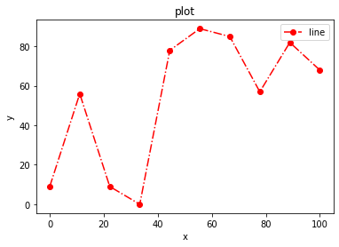
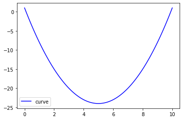
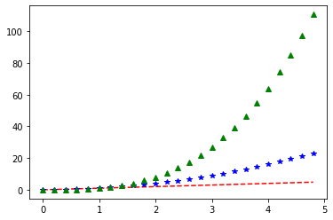
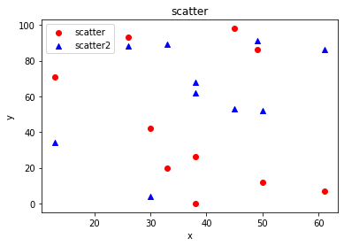
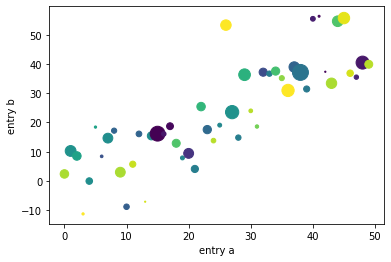
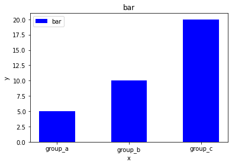
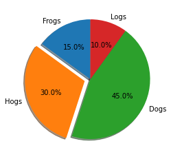
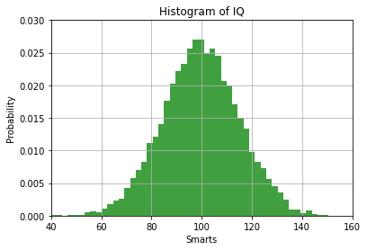
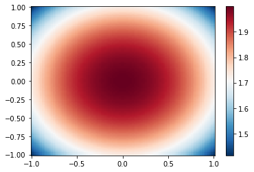
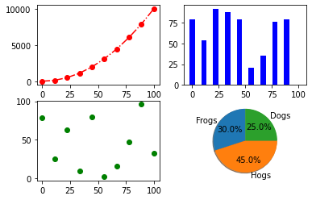

# Matplotlib-pyplot绘制

首先导入matplotlib.pyplot模块
```python
import numpy as np
import matplotlib.pyplot as plt
```

### 1. 绘制点线图

```python
# 绘制折线图
x = np.linspace(0, 100, 10)
y = np.random.randint(0, 100, 10)
plt.plot(x, y, color = 'red', linestyle = '-.', marker = 'o', label = 'line') # 绘制折线图, color: 颜色, linestyle: 线型, marker: 点型, label: 标签
plt.xlabel('x') # x轴标签
plt.ylabel('y') # y轴标签
plt.title('plot') # 标题
plt.legend() # 显示图例
plt.show()
```



```python
# 绘制曲线图
x = np.linspace(0, 10, 100)
y = x**2 - 10*x + 1
plt.plot(x, y, color = 'blue', linestyle = '-', label = 'curve') # 绘制曲线图
plt.legend() # 显示图例
plt.show()
```



```python
# 绘制多条线
t = np.arange(0., 5., 0.2) # 0-5，步长0.2
plt.plot(t, t, 'r--', t, t**2, 'b*', t, t**3, 'g^') # 绘制多条线
plt.show()
# 该图没有设置x轴标签，y轴标签，标题，图例
```



### 2.散点图

```python
# 绘制散点图
x = np.random.randint(0, 100, 10)
y1 = np.random.randint(0, 100, 10)
y2 = np.random.randint(0, 100, 10)
plt.scatter(x, y1, color = 'red', marker = 'o', label = 'scatter') # 绘制散点图
plt.scatter(x, y2, color = 'blue', marker = '^', label = 'scatter2') # 绘制散点图
plt.xlabel('x') # x轴标签
plt.ylabel('y') # y轴标签
plt.title('scatter') # 标题
plt.legend() # 显示图例
plt.show()
```



```python
# 使用字典绘制散点图, 并且设置大小以及颜色
data = {'a': np.arange(50),
        'c': np.random.randint(0, 50, 50),
        'd': np.random.randn(50)}
data['b'] = data['a'] + 10 * np.random.randn(50)
data['d'] = np.abs(data['d']) * 100
plt.scatter('a', 'b', c='c', s='d', data=data) # c:color，s:size
plt.xlabel('entry a')
plt.ylabel('entry b')
plt.show()
```



### 3.条形图

```python
#绘制条形图
x = ['group_a', 'group_b', 'group_c']
y = [5, 10, 20]
plt.bar(x, y, color = 'blue', width = 0.5, label = 'bar') # 绘制条形图
plt.xlabel('x') # x轴标签
plt.ylabel('y') # y轴标签
plt.title('bar') # 标题
plt.legend() # 显示图例
plt.show()
```



### 4.饼图

```python
# 绘制饼图
labels = ['Frogs', 'Hogs', 'Dogs', 'Logs']
sizes = [15, 30, 45, 10]
explode = (0, 0.1, 0, 0) # 突出显示
plt.pie(sizes, labels=labels, autopct='%1.1f%%', shadow=True, startangle=90, explode=explode) # autopct:显示百分比, shadow:阴影, startangle:起始角度
plt.show()
```



### 5.直方图

```python
# 绘制直方图
mu, sigma = 100, 15
x = mu + sigma * np.random.randn(10000)
plt.hist(x, 50, density=1, facecolor='g', alpha=0.75) # density:归一化, facecolor:颜色, alpha:透明度
plt.xlabel('Smarts')
plt.ylabel('Probability')
plt.title('Histogram of IQ')
plt.axis([40, 160, 0, 0.03])
plt.grid(True)
plt.show()
```



### 6. 热图

```python
# 绘制热力图
X, Y = np.meshgrid(np.linspace(-1, 1, 100), np.linspace(-1, 1, 100))
Z = np.sqrt(4 - X**2 - Y**2)
pc = plt.pcolormesh(X, Y, Z, cmap='RdBu_r')
plt.colorbar(pc)
plt.show()
```



### 7.多张子图

```python
#绘制多张子图
plt.subplot(2, 2, 1) # 2行2列，第1个
x = np.linspace(0, 100, 10)
y = x**2 + 1
plt.plot(x, y, color = 'red', linestyle = '-.', marker = 'o', label = 'line')
plt.subplot(2, 2, 2) # 2行2列，第2个
x = np.linspace(0, 100, 10)
y = np.random.randint(0, 100, 10)
plt.bar(x, y, color = 'blue', width = 5, label = 'bar')
plt.subplot(2, 2, 3) # 2行2列，第3个
x = np.linspace(0, 100, 10)
y = np.random.randint(0, 100, 10)
plt.scatter(x, y, color = 'green', marker = 'o', label = 'scatter')
plt.subplot(2, 2, 4) # 2行2列，第4个
labels = ['Frogs', 'Hogs', 'Dogs']
sizes = [30, 45, 25]
plt.pie(sizes, labels=labels, autopct='%1.1f%%', shadow=True, startangle=90)
plt.show()
```


